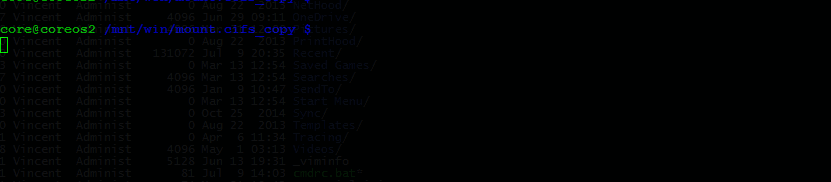
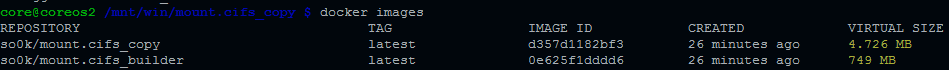

## Build & Package mount.cifs with Dockerception

Provide a mount.cifs for CoreOS (for example) to use, optimized for speed.

### Delivering mount.cifs to a docker host:

```bash
docker run -it --rm -v /opt/bin/:/target so0k/mount.cifs_copy /target
```



### Docker building dockers - keeping them small

docker build process split into a 'builder' docker and a 'runtime' 
docker to keep final docker image as small as possible.

To build the runtime docker image, clone this project and then
run the following command:

```bash
$ ./build.sh
```

Resulting images:


### References:

- https://github.com/coreos/coreos-overlay/issues/595
- https://github.com/jamiemccrindle/dockerception

*NOTE*: this repository can no longer be build automatically by docker hub.